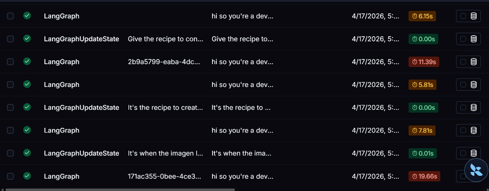
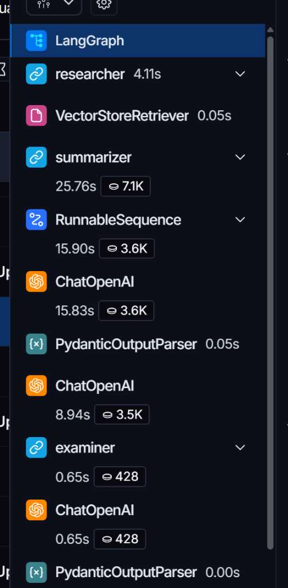
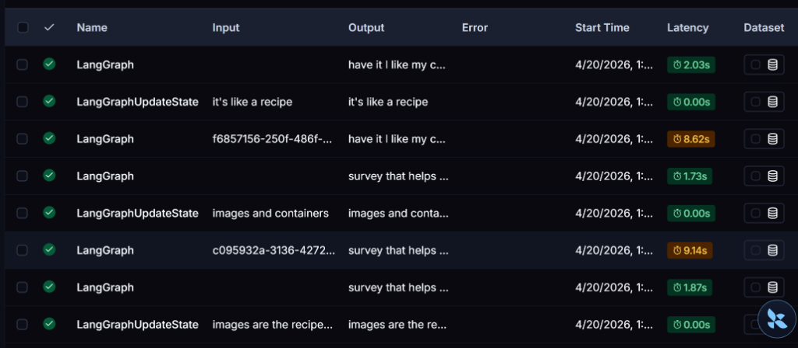
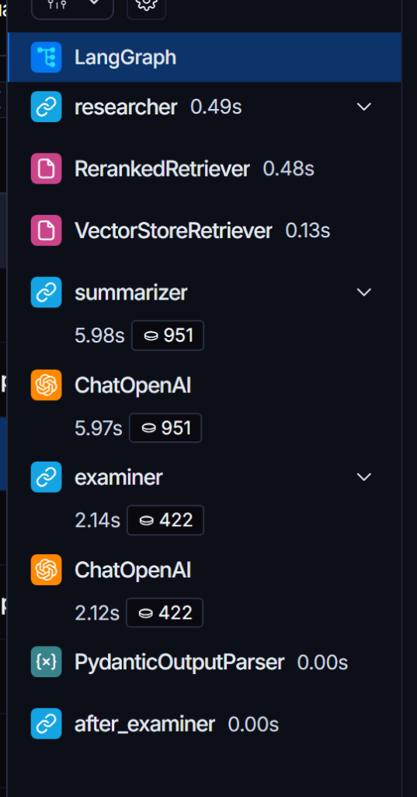
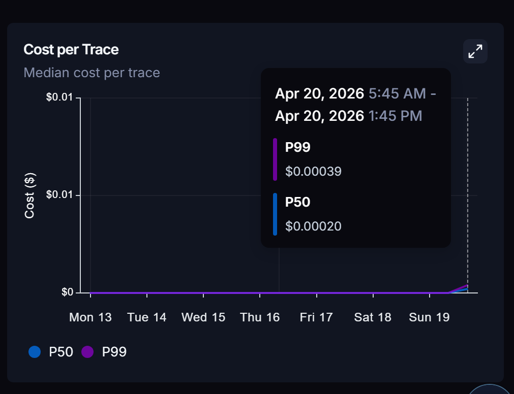

# 🎓 Multi-Agent RAG Tutor

This is an AI-powered tutoring system that uses multiple specialized agents orchestrated via **LangGraph** to deliver personalized learning sessions. It retrieves knowledge from a local document store (RAG), generates summaries, asks questions, and evaluates student answers — all powered by a configurable LLM backend (Ollama, OpenAI, or Gemini).

## 📑 Index
* [Prerequisites](#prerequisites)
* [Technologies Used](#technologies-used)
* [About Tools Used](#about-tools-used)
  * [Why use LangGraph?](#why-use-langgraph-instead-of-simple-chains)
  * [Why use uv instead of pip?](#why-uv-is-better-than-pip-for-this-project)
  * [Why use Docker?](#why-use-docker-for-deployment)
  * [Why use Vectorized information?](#why-should-we-use-vectorized-information-instead-of-a-single-markdown-or-text-file)
  * [Why use Pydantic?](#why-use-pydantic)
* [How to Run Locally](#how-to-run-locally)
* [Environment Configuration](#environment-configuration)
* [Project Structure](#-project-structure)

## Prerequisites
-   **uv** (The blazing-fast Python package manager)
-   Python 3.13 or higher
-   Docker Desktop (if you want to run the containerized version)
-   An OpenAI API Key, Gemini API Key, or Ollama installed locally

## Technologies Used

| Technology | Use | How to install |
| ------------ | ------------ | ------------ |
| **Python 3.13+** | Core project language | `uv python install 3.13` |
| **LangGraph** | Multi-agent orchestration and state management | `uv add langgraph` |
| **Streamlit** | Interactive Web UI | `uv add streamlit` |
| **LangChain** | LLM integration and RAG pipelines | `uv add langchain langchain-openai langchain-google-genai` |
| **ChromaDB** | Vector database for RAG context | `uv add chromadb` |
| **Sentence-Transformers** | HuggingFace local embeddings | `uv add sentence-transformers` |
| **Pydantic** | Data validation and structured LLM outputs | `uv add pydantic pydantic-settings` |
| **python-telegram-bot** | Telegram integration | `uv add python-telegram-bot` |
| **Loguru** | Advanced logging system | `uv add loguru` |
| **Pytest** | Testing framework | `uv add pytest` |
| **Docker** | Containerization for easy deployment | Provided by [Docker Desktop](https://www.docker.com/) |

You can run the `uv sync` command in the project folder to automatically install all dependencies defined in `pyproject.toml`.

>[!IMPORTANT]
> Ensure that uv is installed on your computer before proceeding.
> you can install it by running this command in your terminal: `powershell -c irmo https://astral.sh/uv/install.ps1 | iex`

## 🎥 Functionality Demos

See the Multi-Agent Tutor in action across different platforms:

### 1. Streamlit Web Interface
The primary web dashboard where students can set their topic, configure the number of questions, study the RAG-generated summary, and take their interactive quiz.

<video src="assets/streamlit_demo.mp4" width="100%" controls></video>

### 2. Telegram Bot Integration
The exact same LangGraph backend exposed via a conversational Telegram Bot, allowing students to learn on the go, receive graded feedback, and even capture YouTube videos straight from a chat interface.

<video src="assets/telegram_demo.mp4" width="100%" controls></video>

## About Tools Used

### Why use LangGraph instead of simple chains?
Traditional LLM chains process inputs in a straight line. However, a real tutor sometimes needs to adapt, ask follow-up questions, or grade answers dynamically. LangGraph provides a State Machine architecture allowing us to coordinate a Researcher Agent, Summarizer Agent, Examiner Agent, and Evaluator Agent. It enables checkpoints, loops, and human-in-the-loop interactions (like waiting for the student's answer before proceeding).

### Why uv is better than pip for this project:
I am using uv for this project because it is faster and more modern than pip. I could have used pip, but it is important to know that uv is rapidly becoming the standard due to benefits such as the following:

- **Lightning Speed**: uv is written in Rust and is typically 10x to 100x faster than pip. Installing dependencies that would take minutes with pip happens in seconds with uv.
- **Unified Tooling**: Instead of using multiple tools like pip (for packages), pyenv (for Python versions), virtualenv (for environments), and pip-tools (for locking versions), uv handles everything in one single tool.
- **Reproducible Builds with Lockfiles**: Unlike pip (which by default doesn't lock sub-dependencies), uv generates a `uv.lock` file. This ensures that every developer on your team—and your production server—installs the exact same version of every library, preventing the "it works on my machine" bug.
- **Native pyproject.toml Support**: uv is built to work with the modern Python packaging standard (`pyproject.toml`), which we are using in this project to manage dependencies and configurations in one place.
- **Smart Caching**: uv uses a global cache. If you have multiple projects using the same version of an LLM library, uv only downloads it once.

### Why use Docker for deployment?
Instead of forcing users to install Python, configure virtual environments, and grapple with system-level dependencies, Docker encapsulates the entire environment.
- **Zero "It Works on My Machine" Issues**: The environment is strictly defined in the `Dockerfile`.
- **Easy Swapping**: Using `docker-compose.yml`, users can effortlessly connect the App to a local LLM (like Ollama) or a Cloud LLM without altering their machine's host configurations.
- **Volumes for Data**: By mounting the `knowledge/` and `chroma_db/` folders from the host, users retain data persistence while enjoying full code portability.

### Why should we use vectorized information instead of a single Markdown or text file?
I am using vectorized information for two reasons: efficiency and resource conservation. To give you an example: if you use a `.md` or `.txt` file without vectorizing it first, the AI must read the entire document every time a user asks a question. If your data contains 50,000 tokens, the AI will spend 50,000 tokens on every single query. 

Vectorization turns human language into a language of numbers that computers can navigate mathematically. First, a specialized model takes "chunks" of your text and converts them into an embedding—a long list of coordinates (a vector) in a high-dimensional space. 

Because these numbers represent meaning, concepts that are similar—like "education" and "learning"—end up mathematically close to each other. When a user asks a question, the computer converts that question into its own set of coordinates and simply looks for the "nearest neighbors" in that space.

**How works the vectorization in this project:**
1. **Storage**: The vector store parses your provided `.pdf`, `.txt`, `.md` files or YouTube links, splits them into `1000` character chunks, converts them to numerical vectors using a local HuggingFace Embedding model (`all-MiniLM-L6-v2`), and saves them into a local ChromaDB instance.
2. **Retrieval**: When the student wants to learn about a topic, the Local DB compares the prompt's vector against the text chunks using cosine similarity. The Researcher agent uses the closest chunks, passes them through a Cross-Encoder Reranker to get the absolute top items, and provides this context to the LLM.

### Why use Pydantic?
Pydantic acts as a structural shield for data flowing between the LLMs, the Web UI, and the Telegram bots. In an LLM application, Pydantic is essential for:
- **Ensuring LLM Output Structure**: We define strict schemas (like `GradeFeedback` with integers and strings) to force the LLM to reply via JSON with those exact fields. If the LLM drifts, Pydantic catches it immediately.
- **Auto-completion & Type Hinting**: We know a feedback object definitely has `.grade` and `.feedback` attributes.
- **Smart Configuration Management**: Safely reading environment configurations and making missing keys obvious at runtime startup rather than halfway through a conversation flow.

### Token Optimization & Performance

#### Why use a Reranker? (From 7K down to 1K tokens)
Initially, fetching documents from the vector database using only Cosine Similarity required sending many chunks to the LLM to ensure the correct answer was included. This resulted in high token consumption (e.g., 7.1K tokens per trace) and significantly slower response times (around 15-25 seconds).

To solve this, we implemented a **Cross-Encoder Reranker**:
1. The vector database retrieves a broad set of candidates (e.g., 10 chunks).
2. The Reranker model evaluates the precise relevance of each chunk against the user's specific question.
3. We only send the absolute **top 3** most relevant chunks to the LLM.

**Results:**
- **Tokens**: Reduced from ~7,000 tokens down to under 1,000 tokens per request.
- **Latency**: Processing time dropped drastically. Operations that previously took ~19 seconds now take around ~2 seconds.
- **Cost**: Because we strictly limit the amount of context sent to the API, the current median cost per trace when using models like GPT-4o-mini is exceptionally low — around **$0.00020** per request (a fraction of a cent).

**LangSmith Traces Before vs After Reranker:**

*Before Optimization (4/17): ~19s Latency | ~7.1k Tokens*  

<br>


*After Reranker (4/20): ~2s Latency | ~951 Tokens*  

<br>


*Cost per Trace: $0.00020 (Fraction of a cent)*  


#### Why NOT Small-to-Big Retrieval?
A common advanced RAG technique is **Small-to-Big Retrieval** (or Parent Document Retrieval), where you retrieve a small chunk to find the match, but then pass the entire "parent" document to the LLM to provide full context. 

While powerful for deep research tools reading entire textbooks, for this specific project, it would be **counterproductive and unnecessary**:
- **Goal Mismatch:** This tutor bot is designed to give concise, focused answers and generate specific flashcard-style questions.
- **Token Waste:** Sending the entire parent document would immediately undo our optimization work, flooding the LLM with 5,000+ tokens of irrelevant adjacent text.
- **Latency Hit:** Processing larger context windows linearly increases processing time and cost without adding value to the tutor's specific workflow.

## How to Run Locally

You have two options to run this project: directly on your OS using `uv`, or inside a Docker Container.

### Option 1: Native (with uv)
1. Ensure `uv` is installed.
2. Run the command to install dependencies:
   ```bash
   uv sync
   ```
3. Run the application:
   ```bash
   uv run main.py
   ```
This will automatically launch the interactive Streamlit UI on your browser at `http://localhost:8501`.

### Option 2: Using Docker Container
1. Open Docker Desktop.
2. Run the deployment sequence:
   ```bash
   docker compose up --build
   ```
3. Open `http://localhost:8501` to use the Tutor. To exit the process, hit `Ctrl+C`. Next time you can just run `docker compose up`.

## Environment Configuration

Create a `.env` file in the project root by copying the template (`.env.example`) and fill in your options. The project is LLM agnostic, meaning you can configure it for Ollama, OpenAI, or Gemini.

```env
# ── LLM Provider (Choose ONE and comment out the rest) ──

# Option A: Local Ollama
MODEL_NAME=llama3.1
MODEL_BASE_URL=http://localhost:11434/v1 # Note: Use host.docker.internal if running inside Docker!
API_KEY=ollama

# Option B: OpenAI API 
# MODEL_NAME=gpt-4o-mini
# API_KEY=sk-your-openai-api-key

# Option C: Gemini API 
# MODEL_NAME=gemini-1.5-flash
# API_KEY=your-gemini-key-here

# ── RAG Configuration ──
EMBEDDING_MODEL=all-MiniLM-L6-v2
RETRIEVER_K=10
CHUNK_SIZE=1000
CHUNK_OVERLAP=200

# ── Telegram Bot (optional) ──
TELEGRAM_BOT_TOKEN=your_token_here
```

## 📂 Project Structure

```text
.
├── app/
│   ├── core/              # Core logic: LangGraph agents, Prompt Templates, LLM Factories
│   ├── data/              # Storage for ChromaDB vectors, source knowledge text, and logs
│   ├── ui/                # User interfaces: Streamlit App and Telegram Bot Handlers
│   └── utils/             # Helpers: YouTube fetcher, input sanitizer, logging, schemas
├── tests/                 # Unit and integration tests (Pytest)
├── main.py                # Main application entry point
├── Dockerfile             # Multi-stage build definitions for containerization
├── docker-compose.yml     # Standalone application container orchestrator
└── pyproject.toml         # Dependencies and project specifications
```

>[!NOTE]
> I built this project with a lot of heart, and I hope it helps you create your own intelligent tutor system and save time. Feel free to connect and learn alongside this Multi-Agent bot!
